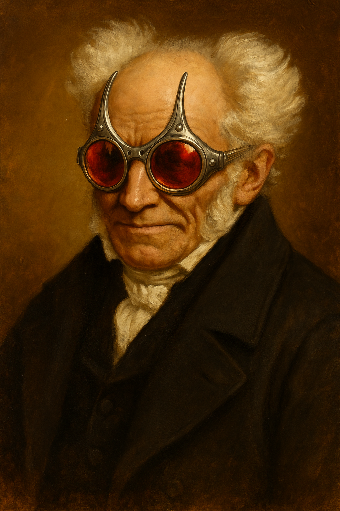
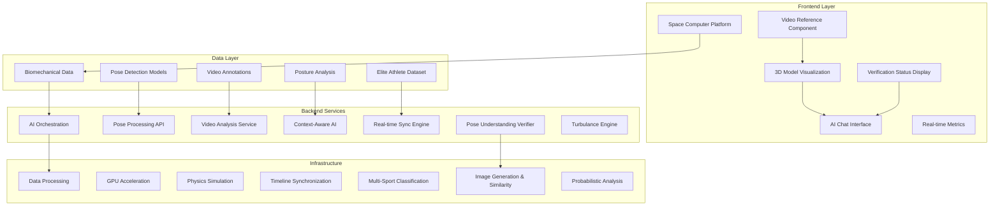

<h1 align="center">Space Computer</h1>

<div align="center">
  
  
  **S-Entropy Gas Molecule Biomechanical Analysis with Oscillatory Computing**
  
  *Transform human movement into gas volume entropy states for ultimate computational efficiency*
  
[](https://opensource.org/licenses/MIT)
[](https://typescriptlang.org/)
[](https://reactjs.org/)
[](#)
[](https://remotion.dev/)


</div>


---

## 🌟 **S-Entropy Gas Molecule System**

This platform transforms **human biomechanics into oscillating gas volumes** where each **molecule represents a computational pixel** encoding arbitrary movement complexity. Through **S-entropy optimization**, entire human bodies become **hierarchical electrical circuits** solved as **gas volume entropy states** rather than traditional coordinate tracking.

**Revolutionary Principle:** Since we're not universal observers, every problem has a Gödelian residue (small s) that requires **creative approximation**. Problem solving becomes **S-value alignment** through **systematic creativity** rather than computational brute force.

### **Gas Molecule Value Proposition**
- **🔬 Entropy State Representation**: Human bodies as gas volumes with single S-values instead of coordinate data
- **⚛️ Molecular Pixel Encoding**: Each gas molecule encodes arbitrary movement complexity through oscillatory endpoints
- **🧠 Creative Problem Solving**: "Making stuff up" as mathematically necessary approximation for finite observers
- **🌪️ Hierarchical Circuit Modeling**: Bodies as electrical circuits solved through gas volume entropy interactions
- **📐 S-Distance Minimization**: Problem solving through creative S-value alignment rather than computation
- **🎯 Gödelian Residue Management**: Systematic handling of observer incompleteness through approximation strategies

---

## 🏗️ **System Architecture**


```mermaid
graph TB
    subgraph "Frontend Layer"
        A[Space Computer Platform]
        A1[Video Reference Component]
        A2[3D Model Visualization]
        A3[AI Chat Interface]
        A4[Real-time Metrics]
        A5[Verification Status Display]
    end
    
    subgraph "Data Layer" 
        B[Biomechanical Data]
        B1[Pose Detection Models]
        B2[Video Annotations]
        B3[Posture Analysis]
        B4[Elite Athlete Dataset]
    end
    
    subgraph "Backend Services"
        C[AI Orchestration]
        C1[Pose Processing API]
        C2[Video Analysis Service]
        C3[Context-Aware AI]
        C4[Real-time Sync Engine]
        C5[Pose Understanding Verifier]
        C6[Turbulance Engine]
    end
    
    subgraph "Infrastructure"
        D[Data Processing]
        D1[GPU Acceleration]
        D2[Physics Simulation]
        D3[Timeline Synchronization]
        D4[Multi-Sport Classification]
        D5[Image Generation & Similarity]
        D6[Probabilistic Analysis]
    end
    
    A --> B
    B --> C
    C --> D
    A1 --> A2
    A2 --> A3
    A5 --> A3
    B1 --> C1
    B2 --> C2
    B3 --> C3
    B4 --> C4
    C5 --> D5
```

---

## 🎥 **Frontend: Space Computer Platform**

### **Core Components**

#### **1. Video Reference System**
```tsx
<VideoReference
  videoUrl="/datasources/annotated/usain_bolt_final.mp4"
  athleteName="Usain Bolt" 
  sport="Sprint"
  position="left"           // Flexible layout positioning
  size="half-screen"        // Responsive sizing
  videoDuration={10.5}
/>
```

**Features:**
- ✅ **Synchronized Playback**: Perfect frame alignment with 3D models
- ✅ **Multi-Layout Support**: Split-screen, picture-in-picture, background modes
- ✅ **Athlete Metadata**: Real-time display of athlete info and progress
- ✅ **Remotion Integration**: Native timeline synchronization

#### **2. 3D Model Visualization**
```tsx
<MannequinViewer 
  modelUrl="/models/elite-athlete.glb"
  pose={currentFramePose}
  highlightedJoints={['left_knee', 'right_knee']}
  onJointSelect={handleJointAnalysis}
/>
```

**Capabilities:**
- 🎯 **Real-time Pose Rendering**: GPU-accelerated 3D joint positioning
- 🔴 **Interactive Joint Selection**: Click any body part for detailed analysis  
- ⚡ **Physics Simulation**: Realistic biomechanical constraints and forces
- 🎨 **Visual Highlighting**: Dynamic joint emphasis and annotation

#### **3. AI Chat Interface**
```tsx
<ChatInterface 
  selectedJoint="left_knee"
  currentMetrics={liveMetrics}
  onAskAboutJoint={(joint, question) => {
    // Context-aware biomechanical analysis
  }}
/>
```

**Intelligence Features:**
- 🧠 **Context Awareness**: Understands current video frame and 3D pose
- 💬 **Natural Language**: Ask questions in plain English about any movement
- 📊 **Data Integration**: AI has access to all biomechanical metrics and pose data
- 🎯 **Sport-Specific Knowledge**: Tailored insights for each athletic discipline

#### **4. Pose Understanding Verification**
```tsx
<VerificationStatus
  isVerifying={isVerifying}
  verificationResult={verificationResult}
  onRetryVerification={handleRetry}
  showDetails={true}
/>
```

**Verification Features:**
- 🔍 **AI Comprehension Validation**: Ensures AI truly understands pose data before analysis
- 🎨 **Image Generation Testing**: AI generates visual representation of poses for comparison
- 📊 **Similarity Scoring**: CLIP-based comparison between actual and generated pose images
- ⚡ **Real-time Feedback**: Instant verification status with confidence metrics
- 🔄 **Retry Mechanism**: Automatic retry for failed verifications
- 📈 **Transparency**: Users see verification confidence and similarity scores
```tsx
<VerificationStatus
  isVerifying={isVerifying}
  verificationResult={verificationResult}
  onRetryVerification={handleRetry}
  showDetails={true}
/>
```

**Verification Features:**
- 🔍 **AI Comprehension Validation**: Ensures AI truly understands pose data before analysis
- 🎨 **Image Generation Testing**: AI generates visual representation of poses for comparison
- 📊 **Similarity Scoring**: CLIP-based comparison between actual and generated pose images
- ⚡ **Real-time Feedback**: Instant verification status with confidence metrics
- 🔄 **Retry Mechanism**: Automatic retry for failed verifications
- 📈 **Transparency**: Users see verification confidence and similarity scores

### **Real-Time Analysis Panels**

#### **Motion Metrics**
- **Speed & Acceleration**: Live calculation from pose changes
- **Stride Analysis**: Length, rate, ground contact timing
- **Vertical Oscillation**: Efficiency measurements
- **Symmetry Scoring**: Left-right movement balance

#### **Biomechanical Feedback**
- **Joint Load Analysis**: Forces and moments at each joint
- **Movement Patterns**: Coordination and efficiency scoring  
- **Technique Recommendations**: AI-powered improvement suggestions
- **Comparative Analysis**: Performance vs. optimal biomechanics

---

## ⚡ **Turbulance Scripting (Optional)**

### **Advanced Probabilistic Analysis Engine**

For researchers and advanced users requiring sophisticated biomechanical analysis, Space Computer optionally integrates with **Turbulance** - a domain-specific programming language designed for probabilistic scientific reasoning and evidence-based analysis.

#### **What is Turbulance?**
Turbulance is a specialized programming language that combines:
- **Probabilistic Programming**: Native uncertainty handling and propagation
- **Evidence-Based Reasoning**: Scientific hypothesis testing with quantified confidence
- **Cross-Domain Analysis**: Pattern recognition across multiple sports disciplines  
- **Metacognitive Analysis**: Self-monitoring and adaptive reasoning systems

#### **Key Features**

**🧪 Scientific Propositions**
```turbulance
proposition EliteAthleteOptimization:
    motion TechniqueEfficiency("Optimal biomechanics maximize performance output")
    motion InjuryPrevention("Elite techniques minimize long-term injury risk")
    
    within synchronized_multimodal_data:
        given power_transfer_efficiency() > 0.85 with_confidence(0.8):
            support TechniqueEfficiency with_weight(0.9)
```

**📊 Uncertainty Quantification**
```turbulance
// Native uncertainty support
item measurement = 9.81 ± 0.02  // Gaussian uncertainty
item confidence_interval = [9.79, 9.83] with_confidence(0.95)

// Uncertainty propagation
item calculated_result = complex_calculation(measurement) 
    uncertainty_propagation: monte_carlo(samples: 10000)
```

**🎯 Goal-Oriented Analysis**
```turbulance
goal PerformanceOptimization = Goal.new(
    description: "Maximize athletic performance while minimizing injury risk",
    objectives: [
        maximize(power_output) with_weight(0.4),
        minimize(injury_risk) with_weight(0.6)
    ],
    success_threshold: 0.85
)
```

**🔬 Evidence Integration**
```turbulance
evidence BiomechanicalData:
    sources:
        - type: "motion_capture", reliability: 0.95
        - type: "force_plates", reliability: 0.98
    
    processing:
        - name: "noise_reduction", operation: "butterworth_filter"
        - name: "gap_filling", operation: "cubic_spline"
```

### **Integration with Space Computer**

#### **Rust-Based Engine**
- **High Performance**: Native Rust implementation for real-time analysis
- **Memory Safe**: Zero-cost abstractions with guaranteed memory safety
- **Concurrent Processing**: Multi-threaded analysis of complex biomechanical models
- **WebAssembly Ready**: Browser-compatible execution for client-side analysis

#### **API Integration**
```typescript
// Frontend Turbulance integration
interface TurbulanceAPI {
  executeScript(script: string): Promise<TurbulanceResult>;
  analyzeAthleteData(athleteId: string, script: string): Promise<BiomechanicalAnalysis>;
  validateProposition(proposition: string, evidence: EvidenceData): Promise<ValidationResult>;
}
```

#### **Advanced Analysis Capabilities**
- **Multi-Sport Comparison**: Cross-disciplinary biomechanical pattern analysis
- **Injury Prediction**: Long-term injury risk modeling with confidence intervals
- **Performance Optimization**: Evidence-based technique recommendations
- **Research Publication**: Generate scientific-quality analysis reports

### **When to Use Turbulance**

**✅ Recommended For:**
- Research institutions requiring rigorous scientific analysis
- Elite athlete training programs needing performance optimization
- Sports science laboratories conducting multi-athlete studies
- Advanced users comfortable with programming concepts

**⚠️ Optional For:**
- General fitness analysis and basic biomechanical insights
- Casual athlete performance tracking
- Simple video analysis without statistical rigor

### **Example: Elite Sprint Analysis**

```turbulance
// Comprehensive sprint biomechanics analysis
proposition SprintOptimization:
    context athletes = ["usain_bolt_final", "asafa_powell_race"]
    
    motion OptimalStartMechanics("Block start maximizes initial acceleration")
    motion DrivePhaseEfficiency("First 30m optimizes power application")
    
    within sprint_phase_segmentation:
        segment start_phase = extract_phase(0, 2):
            given block_angle in optimal_range(42°, 48°) with_confidence(0.85):
                support OptimalStartMechanics with_weight(0.9)
                
                predicted_improvement: calculate_optimization_potential(
                    current_angles: get_athlete_angles(),
                    optimal_ranges: [[42°, 48°]],
                    athlete_anthropometrics: get_athlete_dimensions()
                )
```

---

## ⚙️ **Backend Services**

### **1. Data Processing Pipeline**

#### **Pose Detection Service**
```typescript
interface PoseDetectionAPI {
  processVideo(videoFile: File): Promise<PoseData[]>;
  extractKeyframes(timestamps: number[]): Promise<KeyframeData>;
  analyzeBiomechanics(poses: PoseData[]): Promise<BiomechanicalMetrics>;
}
```

**Processing Chain:**
1. **Video Ingestion**: Accept MP4/MOV athlete footage
2. **Pose Extraction**: MediaPipe/OpenPose landmark detection
3. **3D Reconstruction**: Convert 2D poses to 3D biomechanical models
4. **Metrics Calculation**: Real-time speed, force, angle computations
5. **Quality Validation**: Confidence scoring and error correction

#### **AI Analysis Service**
```typescript
interface AIAnalysisService {
  generateInsights(context: AnalysisContext): Promise<AIResponse>;
  answerQuestion(question: string, context: FrameContext): Promise<string>;
  compareAthletes(athleteIds: string[]): Promise<ComparisonReport>;
}
```

**AI Capabilities:**
- 🧠 **Contextual Understanding**: Interprets current frame, selected joints, metrics
- 📚 **Sports Science Knowledge**: Trained on biomechanics literature and best practices
- 🎯 **Technique Analysis**: Identifies optimal vs. suboptimal movement patterns
- 📊 **Performance Comparison**: Cross-athlete and cross-sport analysis
- 🔍 **Pose Understanding Verification**: Validates AI comprehension before providing analysis
- ⚡ **Turbulance Integration**: Optional probabilistic analysis with domain-specific scripting

### **2. Pose Understanding Verification System**

#### **Verification Pipeline**
```typescript
interface PoseVerificationService {
  verifyUnderstanding(poseData: PoseData, query: string): Promise<VerificationResult>;
  generatePoseDescription(poseData: PoseData): string;
  renderPoseSkeleton(poseData: PoseData): ImageData;
  calculateSimilarity(actual: ImageData, generated: ImageData): number;
}
```

**Verification Process:**
1. **🎨 Skeleton Rendering**: Convert pose data to visual skeleton representation
2. **📝 Description Generation**: Create natural language description of pose
3. **🤖 AI Image Generation**: Use Stable Diffusion to generate pose image from description
4. **🔍 Similarity Analysis**: Compare generated image with actual pose using CLIP embeddings
5. **✅ Validation Decision**: Determine if AI understanding meets confidence threshold

**Quality Assurance Features:**
- 🎯 **Configurable Thresholds**: Adjustable similarity requirements (default: 70%)
- 🔄 **Retry Logic**: Automatic retry for failed verifications (max 2 attempts)
- 💾 **Result Caching**: Cache verification results to improve performance
- 🐛 **Debug Imaging**: Save generated images for troubleshooting
- 📊 **Performance Metrics**: Track verification success rates and timing

### **3. Turbulance Probabilistic Engine**

#### **Advanced Scientific Computing**
```typescript
interface TurbulanceEngine {
  parseScript(script: string): Promise<TurbulanceAST>;
  executeAnalysis(ast: TurbulanceAST, data: AthleteData): Promise<ProbabilisticResult>;
  validateProposition(proposition: Proposition, evidence: Evidence): Promise<ValidationResult>;
  optimizeGoals(goals: Goal[], constraints: Constraint[]): Promise<OptimizationResult>;
}
```

**Turbulance Capabilities:**
- 🔬 **Scientific Propositions**: Hypothesis testing with quantified evidence support
- 📊 **Uncertainty Propagation**: Monte Carlo simulations and Bayesian inference
- 🎯 **Goal Optimization**: Multi-objective optimization with biomechanical constraints
- 🧠 **Metacognitive Analysis**: Self-monitoring and adaptive reasoning
- 📈 **Evidence Integration**: Multi-source data fusion with reliability weighting
- 🔄 **Iterative Refinement**: Continuous improvement through feedback loops

**Research Applications:**
```turbulance
// Example: Injury risk prediction with uncertainty quantification
proposition InjuryRiskAssessment:
    context athlete_history = load_injury_database()
    context biomechanical_data = load_current_analysis()
    
    motion RiskFactorIdentification("Movement patterns correlate with injury probability")
    motion PreventionStrategies("Technique modifications reduce injury risk")
    
    within longitudinal_analysis:
        given stress_concentration > injury_threshold with_confidence(0.8):
            support RiskFactorIdentification with_weight(0.9)
            
            prediction_model: bayesian_network(
                risk_factors: [stress_concentration, load_history, technique_deviation],
                injury_probability: monte_carlo_simulation(samples: 10000),
                confidence_interval: 0.95
            )
```

### **4. Real-Time Synchronization Engine**

#### **Timeline Orchestration**
```typescript
class SyncEngine {
  syncVideoWithPoseData(videoTimestamp: number): PoseFrame;
  calculateFrameMetrics(poseData: PoseFrame): MotionMetrics;
  predictNextFrame(currentPose: PoseFrame): PoseFrame;
  handlePlaybackControls(action: PlaybackAction): void;
}
```

**Synchronization Features:**
- ⏱️ **Frame-Perfect Alignment**: Video and 3D model synchronized to milliseconds
- 🔄 **Bidirectional Control**: Video controls update 3D model and vice versa
- 📈 **Predictive Loading**: Preload upcoming pose data for smooth playback
- 🎛️ **Playback Management**: Play, pause, seek, speed control across all components

---

## 🔄 **Orchestration Layer**

### **System Integration**

#### **Component Communication**
```typescript
// Central state management for synchronized playback
interface SystemState {
  currentFrame: number;
  selectedAthlete: AthleteData;
  activeJoints: string[];
  analysisMode: 'real-time' | 'comparative' | 'technique-focus';
  aiChatContext: ChatContext;
}

// Event-driven architecture
class OrchestrationEngine {
  onVideoTimeUpdate(timestamp: number): void;
  onJointSelection(jointName: string): void;
  onAIQuestionAsked(question: string, context: any): void;
  onMetricsCalculated(metrics: MotionMetrics): void;
}
```

#### **Data Flow Architecture**
```
Video Playback → Frame Extract → Pose Lookup → 3D Update → Metrics Calc → AI Context → User Interface
     ↑                                                                                        ↓
User Controls ← AI Responses ← Context Analysis ← Real-time Metrics ← Joint Selection ← Click Events
```

### **Performance Optimization**

#### **GPU Acceleration**
- **3D Rendering**: WebGL-based mannequin visualization
- **Physics Simulation**: GPU.js for biomechanical calculations  
- **Video Processing**: Hardware-accelerated decoding and frame extraction
- **AI Inference**: GPU-optimized model serving for real-time responses

#### **Caching Strategy**
- **Pose Data**: Frame-indexed caching for instant lookup
- **Video Segments**: Strategic preloading based on user interaction patterns
- **AI Responses**: Context-aware caching of similar questions
- **3D Models**: Efficient mesh caching and level-of-detail optimization

---

## 📊 **Elite Athlete Dataset**

### **Available Athletes & Sports**

| **Athlete** | **Sport** | **Specialty** | **Data Quality** |
|-------------|-----------|---------------|------------------|
| **Usain Bolt** | Sprint | 100m World Record | ⭐⭐⭐⭐⭐ |
| **Asafa Powell** | Sprint | Former World Record | ⭐⭐⭐⭐⭐ |
| **Didier Drogba** | Football | Header Technique | ⭐⭐⭐⭐⭐ |
| **Derek Chisora** | Boxing | Power Punching | ⭐⭐⭐⭐⭐ |
| **Jonah Lomu** | Rugby | Power Running | ⭐⭐⭐⭐⭐ |
| **Mahela Jayawardene** | Cricket | Batting Technique | ⭐⭐⭐⭐ |
| **Kevin Pietersen** | Cricket | Shot Analysis | ⭐⭐⭐⭐ |
| **Daniel Sturridge** | Football | Dribbling Mechanics | ⭐⭐⭐⭐ |
| **Gareth Bale** | Football | Kicking Technique | ⭐⭐⭐⭐ |
| **Jordan Henderson** | Football | Passing Biomechanics | ⭐⭐⭐⭐ |
| **Raheem Sterling** | Football | Sprint Analysis | ⭐⭐⭐⭐ |

### **Data Structure**

#### **Pose Detection Data**
```json
{
  "metadata": {
    "athlete": "usain_bolt_final",
    "sport": "sprint", 
    "fps": 30,
    "duration": 10.5,
    "resolution": "1920x1080"
  },
  "frames": {
    "0": {
      "pose_landmarks": [
        {"x": 0.5, "y": 0.3, "z": 0.1, "visibility": 0.99},
        // ... 33 total landmarks
      ],
      "timestamp": 0.0
    }
  }
}
```

#### **Biomechanical Analysis**
```json
{
  "joint_angles": {
    "left_knee": 45.2,
    "right_knee": 43.8,
    "left_ankle": 12.5
  },
  "forces": {
    "ground_reaction": {"x": 120, "y": 890, "z": 45}
  },
  "stability_metrics": {
    "center_of_mass": {"x": 0.0, "y": 1.2, "z": 0.0},
    "balance_score": 0.92
  }
}
```

---

## 🚀 **Getting Started**

### **Prerequisites**
```bash
Node.js 18+
npm or yarn
WebGL-compatible browser
Git LFS (for large video files)
Rust (optional, for Turbulance advanced analysis)
```

### **Quick Setup**
```bash
# Clone the repository
git clone <repository-url>
cd biomechanical-analysis-platform

# Install dependencies
npm install

# Copy your athlete data
cp -r datasources/ space-computer/public/datasources/

# Start the development server
cd space-computer
npm run dev

# Build for production
npm run build
```

### **First Analysis**
```tsx
import { SimpleVideoAnalysis } from './src/remotion/SimpleVideoAnalysis';

// Render Usain Bolt sprint analysis
<SimpleVideoAnalysis 
  athleteId="usain_bolt_final"
  athleteName="Usain Bolt"
  sport="Sprint"
/>
```

---

## 📖 **API Documentation**

### **Core APIs**

#### **BiomechanicalDataLoader**
```typescript
// Load athlete data
const athleteData = await dataLoader.loadAthleteData('usain_bolt_final');

// Get frame-synchronized pose
const currentPose = dataLoader.getFrameData('usain_bolt_final', frameNumber);

// Get biomechanical analysis  
const postureAnalysis = dataLoader.getPostureAnalysis('usain_bolt_final', frameNumber);

// Convert pose formats
const spaceComputerPose = dataLoader.convertPoseDataToSpaceComputer(jsonData);
```

#### **VideoReference Component**
```typescript
interface VideoReferenceProps {
  videoUrl: string;
  athleteName?: string;
  sport?: string;
  position?: 'left' | 'right' | 'background' | 'picture-in-picture';
  size?: 'small' | 'medium' | 'large' | 'half-screen';
  opacity?: number;
  videoDuration?: number;
  style?: React.CSSProperties;
}
```

#### **AI Chat Integration**
```typescript
interface ChatInterfaceProps {
  selectedJoint?: string;
  currentMetrics: MotionMetrics;
  currentPose?: PoseData;
  onAskAboutJoint: (joint: string, question: string) => void;
  aiEnabled?: boolean;
}
```

#### **Pose Verification API**
```typescript
// Verify single pose understanding
POST /api/verification/verify-pose
{
  "pose_data": PoseData,
  "query": string,
  "similarity_threshold": 0.7,
  "save_images": false
}

// Batch verification
POST /api/verification/batch-verify
{
  "requests": PoseVerificationRequest[]
}

// System health check
GET /api/verification/health

// Test verification system
POST /api/verification/test-verification
```

#### **Turbulance Scripting API**
```typescript
// Execute Turbulance script
POST /api/turbulance/execute
{
  "script": string,
  "athlete_data": AthleteData[],
  "config": TurbulanceConfig
}

// Validate proposition
POST /api/turbulance/validate-proposition
{
  "proposition": PropositionDefinition,
  "evidence": EvidenceCollection,
  "confidence_threshold": 0.75
}

// Optimize biomechanical goals
POST /api/turbulance/optimize-goals
{
  "goals": Goal[],
  "constraints": Constraint[],
  "athlete_profile": AthleteProfile
}

// Get analysis recommendations
GET /api/turbulance/recommendations/{athlete_id}
?confidence_min=0.8&include_uncertainty=true
```

### **Data Models**

#### **AthleteData Interface**
```typescript
interface AthleteData {
  id: string;
  name: string;
  sport: string;
  videoUrl: string;
  modelData: {
    poseData: PoseData;
    frameCount: number;
  };
  postureData: PostureData;
  metadata: {
    fps: number;
    duration: number;
    frameCount: number;
    resolution: { width: number; height: number };
  };
}
```

#### **Verification Data Models**
```typescript
interface VerificationResult {
  understood: boolean;
  confidence: number;
  similarity_score: number;
  verification_time: number;
  error_message?: string;
  verification_id?: string;
}

interface PoseVerificationRequest {
  pose_data: Record<string, { x: number; y: number; confidence: number }>;
  query: string;
  similarity_threshold?: number;
  save_images?: boolean;
}

interface VerificationStats {
  total_verifications: number;
  success_rate: number;
  average_confidence: number;
  average_similarity: number;
  average_verification_time: number;
}
```

#### **Turbulance Data Models**
```typescript
interface TurbulanceConfig {
  uncertainty_model: "bayesian_inference" | "monte_carlo" | "fuzzy_logic";
  confidence_threshold: number;
  verification_required: boolean;
  real_time_analysis: boolean;
  max_iterations: number;
  timeout_seconds: number;
}

interface PropositionDefinition {
  name: string;
  motions: Motion[];
  context: Record<string, any>;
  evidence_requirements: EvidenceRequirement[];
}

interface Motion {
  name: string;
  description: string;
  success_criteria: SuccessCriteria[];
  weight: number;
}

interface Goal {
  id: string;
  description: string;
  objectives: Objective[];
  success_threshold: number;
  constraints: Constraint[];
  personalization_factors: Record<string, any>;
}

interface ProbabilisticResult {
  success: boolean;
  propositions: Record<string, PropositionResult>;
  goals: Record<string, GoalResult>;
  recommendations: Recommendation[];
  uncertainty_metrics: UncertaintyMetrics;
  execution_time: number;
}

interface UncertaintyMetrics {
  overall_confidence: number;
  evidence_reliability: number;
  model_uncertainty: number;
  data_quality: number;
  prediction_variance: number;
  bias_indicators: string[];
}
```

---

## 🎛️ **Configuration**

### **Layout Customization**
```typescript
// Split-screen layout (recommended)
const splitScreenConfig = {
  videoPosition: 'left',
  videoSize: 'half-screen',
  analysisPanel: 'right',
  aiChat: 'overlay'
};

// Picture-in-picture layout
const pipConfig = {
  videoPosition: 'picture-in-picture', 
  videoSize: 'medium',
  analysisPanel: 'full-width',
  aiChat: 'sidebar'
};

// Background reference layout
const backgroundConfig = {
  videoPosition: 'background',
  videoSize: 'large',
  analysisPanel: 'overlay',
  aiChat: 'modal'
};
```

### **Performance Tuning**
```typescript
// GPU acceleration settings
const performanceConfig = {
  enableGPUPhysics: true,
  maxFrameRate: 60,
  videoCacheSize: '500MB',
  poseDataPreload: 120, // frames
  aiResponseCache: true
};
```

### **Pose Verification Configuration**
```typescript
// Verification system settings
const verificationConfig = {
  enabled: true,                    // Enable/disable verification
  similarity_threshold: 0.7,        // Minimum similarity for understanding
  max_retries: 2,                   // Maximum retry attempts
  cache_results: true,              // Cache verification results
  save_debug_images: false,         // Save images for debugging
  batch_size_limit: 10,             // Maximum batch verification size
  timeout_seconds: 30,              // Verification timeout
  image_generation_model: "runwayml/stable-diffusion-v1-5"
};
```

### **Turbulance Scripting Configuration**
```typescript
// Advanced probabilistic analysis settings
const turbulanceConfig = {
  enabled: false,                   // Enable for advanced research use
  uncertainty_model: "bayesian_inference",  // Analysis method
  confidence_threshold: 0.75,       // Minimum confidence for conclusions
  verification_required: true,      // Validate AI understanding
  real_time_analysis: false,        // Enable real-time probabilistic updates
  max_iterations: 10000,            // Maximum optimization iterations
  timeout_seconds: 300,             // Script execution timeout
  parallel_processing: true,        // Multi-threaded analysis
  save_intermediate_results: false, // Debug probabilistic computations
  monte_carlo_samples: 10000,       // Uncertainty propagation samples
  optimization_algorithm: "multi_objective_genetic",  // Goal optimization
  evidence_weighting: "reliability_based",  // How to combine evidence
};
```

---

## 🧪 **Usage Examples**

### **Basic Video Analysis**
```tsx
function BasicAnalysis() {
  return (
    <SimpleVideoAnalysis 
      athleteId="usain_bolt_final"
      athleteName="Usain Bolt"
      sport="Sprint"
    />
  );
}
```

### **Analysis with Verification**
```tsx
function VerifiedAnalysis() {
  const [verificationResult, setVerificationResult] = useState(null);
  const [isVerifying, setIsVerifying] = useState(false);

  const handlePoseAnalysis = async (poseData, query) => {
    setIsVerifying(true);
    
    // Verify AI understanding before analysis
    const verification = await verifyPoseUnderstanding(poseData, query);
    setVerificationResult(verification);
    
    if (verification.understood) {
      // Proceed with high-confidence analysis
      const analysis = await performBiomechanicalAnalysis(poseData, query);
      return analysis;
    } else {
      // Handle failed verification
      console.warn('AI verification failed - results may be inaccurate');
    }
    
    setIsVerifying(false);
  };

  return (
    <div>
      <VerificationStatus
        isVerifying={isVerifying}
        verificationResult={verificationResult}
        onRetryVerification={() => handlePoseAnalysis(currentPose, lastQuery)}
        showDetails={true}
      />
      <SimpleVideoAnalysis 
        athleteId="usain_bolt_final"
        athleteName="Usain Bolt"
        sport="Sprint"
        onPoseAnalysis={handlePoseAnalysis}
      />
    </div>
  );
}
```

### **Multi-Athlete Comparison**
```tsx 
function ComparisonAnalysis() {
  const athletes = ['usain_bolt_final', 'asafa_powell_race'];
  
  return (
    <div style={{ display: 'flex' }}>
      {athletes.map(athleteId => (
        <VideoAnalysisComposition
          key={athleteId}
          athleteId={athleteId}
          videoPosition="left"
          videoSize="medium"
        />
      ))}
    </div>
  );
}
```

### **Sport-Specific Analysis**
```tsx
function SportFocusedAnalysis() {
  return (
    <div>
      {/* Sprint Technique Analysis */}
      <VideoAnalysisComposition 
        athleteId="usain_bolt_final"
        videoPosition="background"
        videoSize="large"
      />
      
      {/* Boxing Power Analysis */}
      <VideoAnalysisComposition 
        athleteId="derek_chisora_punch"
        videoPosition="picture-in-picture"
        videoSize="small"
      />
    </div>
  );
}
```

### **Advanced Turbulance Analysis**
```tsx
function TurbulanceResearchAnalysis() {
  const [turbulanceResult, setTurbulanceResult] = useState(null);
  const [isAnalyzing, setIsAnalyzing] = useState(false);

  const runProbabilisticAnalysis = async () => {
    setIsAnalyzing(true);
    
    const turbulanceScript = `
      proposition EliteSprintOptimization:
        context athletes = ["usain_bolt_final", "asafa_powell_race"]
        
        motion StartEfficiency("Optimal block start mechanics")
        motion DrivePhaseOptimization("Maximum acceleration in first 30m")
        motion TopSpeedMaintenance("Velocity sustainability")
        
        within biomechanical_analysis:
          given block_angle in optimal_range(42°, 48°) with_confidence(0.85):
            support StartEfficiency with_weight(0.9)
            
          goal MaximizePerformance = Goal.new(
            description: "Optimize sprint performance with injury prevention",
            objectives: [
              maximize(sprint_velocity) with_weight(0.6),
              minimize(injury_risk) with_weight(0.4)
            ],
            success_threshold: 0.8
          )
    `;

    try {
      const result = await turbulanceAPI.executeScript(turbulanceScript);
      setTurbulanceResult(result);
    } catch (error) {
      console.error('Turbulance analysis failed:', error);
    }
    
    setIsAnalyzing(false);
  };

  return (
    <div>
      <SimpleVideoAnalysis 
        athleteId="usain_bolt_final"
        athleteName="Usain Bolt"
        sport="Sprint"
      />
      
      <button onClick={runProbabilisticAnalysis} disabled={isAnalyzing}>
        {isAnalyzing ? 'Running Probabilistic Analysis...' : 'Advanced Turbulance Analysis'}
      </button>
      
      {turbulanceResult && (
        <div className="turbulance-results">
          <h3>Scientific Analysis Results</h3>
          <p>Overall Confidence: {turbulanceResult.uncertainty_metrics.overall_confidence}</p>
          <ul>
            {turbulanceResult.recommendations.map(rec => (
              <li key={rec.id}>
                {rec.description} (Confidence: {rec.confidence})
              </li>
            ))}
          </ul>
        </div>
      )}
    </div>
  );
}
```

---

## 🔧 **Development**

### **Project Structure**
```
├── space-computer/                 # Frontend Platform
│   ├── src/
│   │   ├── components/
│   │   │   ├── biomechanics/      # Core analysis components
│   │   │   ├── ai/                # AI chat interface
│   │   │   ├── verification/      # Pose understanding verification
│   │   │   └── ui/                # UI components
│   │   ├── remotion/              # Video compositions
│   │   ├── utils/                 # Data processing utilities
│   │   └── hooks/                 # React hooks
│   └── public/
│       └── datasources/           # Athlete data
├── backend/                       # Backend Services
│   ├── core/
│   │   ├── pose_understanding.py  # Verification system
│   │   └── biomechanical_analysis.py
│   ├── api/
│   │   ├── verification_endpoints.py # Verification API
│   │   └── athlete_endpoints.py
│   ├── turbulance_parser/         # Turbulance scripting engine
│   │   ├── src/                   # Rust implementation
│   │   │   ├── parser.rs          # Language parser
│   │   │   ├── compiler.rs        # AST compiler
│   │   │   └── executor.rs        # Probabilistic execution
│   │   └── Cargo.toml             # Rust dependencies
│   └── ai/                        # AI models and processing
├── datasources/                   # Original data files
│   ├── models/                    # JSON pose data
│   ├── annotated/                 # MP4 videos
│   ├── posture/                   # Biomechanical analysis
│   └── gifs/                      # Visualization outputs
├── scripts/
│   └── test_pose_verification.py  # Verification testing
└── assets/                        # Platform assets
    └── img/                       # Images and logos
```

### **Contributing Guidelines**

1. **Code Style**: Follow TypeScript best practices with ESLint/Prettier
2. **Component Design**: Use functional components with hooks
3. **Data Processing**: Maintain type safety with proper interfaces
4. **Performance**: Optimize for 60fps rendering and real-time analysis
5. **Documentation**: Add JSDoc comments for all public APIs

### **Testing Strategy**
```bash
# Unit tests for data processing
npm run test:unit

# Integration tests for video sync
npm run test:integration  

# End-to-end analysis workflow
npm run test:e2e

# Performance benchmarks
npm run test:performance

# Test pose understanding verification
python scripts/test_pose_verification.py

# Test Turbulance scripting engine (optional)
cd backend/turbulance_parser
cargo test

# Test Turbulance integration
python scripts/test_turbulance_integration.py
```

---

## 🤝 **Contributing**

We welcome contributions to enhance the biomechanical analysis platform! 

### **Areas for Enhancement**
- 🎯 **New Sports**: Add additional athletic disciplines and athletes
- 🤖 **AI Improvements**: Enhance contextual understanding and analysis depth
- 📊 **Metrics Expansion**: Develop new biomechanical measurement algorithms  
- 🎨 **UI/UX**: Improve visualization and interaction design
- ⚡ **Performance**: Optimize rendering and data processing pipelines
- 🔍 **Verification Enhancement**: Improve pose understanding validation accuracy and speed
- 🎨 **Image Generation**: Enhance AI-generated pose visualizations for better verification
- ⚡ **Turbulance Language**: Expand probabilistic programming constructs and domain-specific functions
- 🔬 **Research Integration**: Develop specialized Turbulance modules for specific sports science domains

### **Contribution Process**
1. Fork the repository
2. Create a feature branch (`git checkout -b feature/amazing-feature`)
3. Add comprehensive tests for new functionality
4. Ensure all existing tests pass
5. Submit a pull request with detailed description

---

## 📜 **License**

This project is licensed under the MIT License - see the [LICENSE](LICENSE) file for details.

---

## 🙏 **Acknowledgments**

- **Elite Athletes**: Thanks to the world-class athletes whose performance data makes this analysis possible
- **Sports Science Community**: Built on decades of biomechanical research and best practices
- **Open Source Libraries**: Powered by React, Remotion, Three.js, and the broader JavaScript ecosystem
- **AI Research**: Leveraging advances in computer vision, pose detection, and natural language processing

---

<div align="center">
  
**Transform Athletic Performance Through Intelligent Biomechanical Analysis**

*Built with ❤️ for sports science, powered by AI*

[🚀 Get Started](#getting-started) • [📖 Documentation](#api-documentation) • [⚡ Turbulance Scripting](#turbulance-scripting-optional) • [🤝 Contribute](#contributing)

</div>
