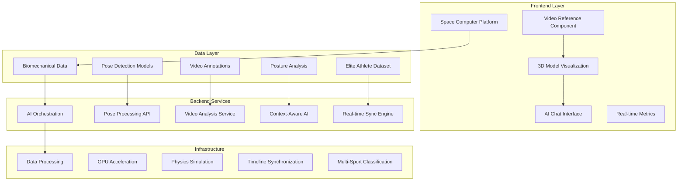

<h1 align="center">Space Computer</h1>

<div align="center">
  
  
  **AI-Powered 3D Biomechanical Analysis with Video Integration**
  
  *Transform elite athlete movement data into interactive, intelligent analysis experiences*
  
  [](https://opensource.org/licenses/MIT)
  [](https://typescriptlang.org/)
  [](https://reactjs.org/)
  [](https://remotion.dev/)
</div>

---

## 🌟 **System Overview**

This platform combines **real-world athlete video analysis** with **3D biomechanical modeling** and **conversational AI** to create an unprecedented sports science exploration experience. Featuring world-class athletes including Usain Bolt, Didier Drogba, Derek Chisora, and more across multiple sports disciplines.

### **Core Value Proposition**
- **📹 Video Integration**: Synchronized playback of annotated athlete videos with 3D pose models
- **🤖 AI-Powered Analysis**: Click anywhere to ask intelligent questions about movement biomechanics  
- **🎯 Real-Time Insights**: Live metrics, joint analysis, and technique recommendations
- **🏃‍♂️ Elite Athlete Data**: World-record holders and professional athletes across 6+ sports

---

## 🏗️ **System Architecture**



---

## 🎥 **Frontend: Space Computer Platform**

### **Core Components**

#### **1. Video Reference System**
```tsx
<VideoReference
  videoUrl="/datasources/annotated/usain_bolt_final.mp4"
  athleteName="Usain Bolt" 
  sport="Sprint"
  position="left"           // Flexible layout positioning
  size="half-screen"        // Responsive sizing
  videoDuration={10.5}
/>
```

**Features:**
- ✅ **Synchronized Playback**: Perfect frame alignment with 3D models
- ✅ **Multi-Layout Support**: Split-screen, picture-in-picture, background modes
- ✅ **Athlete Metadata**: Real-time display of athlete info and progress
- ✅ **Remotion Integration**: Native timeline synchronization

#### **2. 3D Model Visualization**
```tsx
<MannequinViewer 
  modelUrl="/models/elite-athlete.glb"
  pose={currentFramePose}
  highlightedJoints={['left_knee', 'right_knee']}
  onJointSelect={handleJointAnalysis}
/>
```

**Capabilities:**
- 🎯 **Real-time Pose Rendering**: GPU-accelerated 3D joint positioning
- 🔴 **Interactive Joint Selection**: Click any body part for detailed analysis  
- ⚡ **Physics Simulation**: Realistic biomechanical constraints and forces
- 🎨 **Visual Highlighting**: Dynamic joint emphasis and annotation

#### **3. AI Chat Interface**
```tsx
<ChatInterface 
  selectedJoint="left_knee"
  currentMetrics={liveMetrics}
  onAskAboutJoint={(joint, question) => {
    // Context-aware biomechanical analysis
  }}
/>
```

**Intelligence Features:**
- 🧠 **Context Awareness**: Understands current video frame and 3D pose
- 💬 **Natural Language**: Ask questions in plain English about any movement
- 📊 **Data Integration**: AI has access to all biomechanical metrics and pose data
- 🎯 **Sport-Specific Knowledge**: Tailored insights for each athletic discipline

### **Real-Time Analysis Panels**

#### **Motion Metrics**
- **Speed & Acceleration**: Live calculation from pose changes
- **Stride Analysis**: Length, rate, ground contact timing
- **Vertical Oscillation**: Efficiency measurements
- **Symmetry Scoring**: Left-right movement balance

#### **Biomechanical Feedback**
- **Joint Load Analysis**: Forces and moments at each joint
- **Movement Patterns**: Coordination and efficiency scoring  
- **Technique Recommendations**: AI-powered improvement suggestions
- **Comparative Analysis**: Performance vs. optimal biomechanics

---

## ⚙️ **Backend Services**

### **1. Data Processing Pipeline**

#### **Pose Detection Service**
```typescript
interface PoseDetectionAPI {
  processVideo(videoFile: File): Promise<PoseData[]>;
  extractKeyframes(timestamps: number[]): Promise<KeyframeData>;
  analyzeBiomechanics(poses: PoseData[]): Promise<BiomechanicalMetrics>;
}
```

**Processing Chain:**
1. **Video Ingestion**: Accept MP4/MOV athlete footage
2. **Pose Extraction**: MediaPipe/OpenPose landmark detection
3. **3D Reconstruction**: Convert 2D poses to 3D biomechanical models
4. **Metrics Calculation**: Real-time speed, force, angle computations
5. **Quality Validation**: Confidence scoring and error correction

#### **AI Analysis Service**
```typescript
interface AIAnalysisService {
  generateInsights(context: AnalysisContext): Promise<AIResponse>;
  answerQuestion(question: string, context: FrameContext): Promise<string>;
  compareAthletes(athleteIds: string[]): Promise<ComparisonReport>;
}
```

**AI Capabilities:**
- 🧠 **Contextual Understanding**: Interprets current frame, selected joints, metrics
- 📚 **Sports Science Knowledge**: Trained on biomechanics literature and best practices
- 🎯 **Technique Analysis**: Identifies optimal vs. suboptimal movement patterns
- 📊 **Performance Comparison**: Cross-athlete and cross-sport analysis

### **2. Real-Time Synchronization Engine**

#### **Timeline Orchestration**
```typescript
class SyncEngine {
  syncVideoWithPoseData(videoTimestamp: number): PoseFrame;
  calculateFrameMetrics(poseData: PoseFrame): MotionMetrics;
  predictNextFrame(currentPose: PoseFrame): PoseFrame;
  handlePlaybackControls(action: PlaybackAction): void;
}
```

**Synchronization Features:**
- ⏱️ **Frame-Perfect Alignment**: Video and 3D model synchronized to milliseconds
- 🔄 **Bidirectional Control**: Video controls update 3D model and vice versa
- 📈 **Predictive Loading**: Preload upcoming pose data for smooth playback
- 🎛️ **Playback Management**: Play, pause, seek, speed control across all components

---

## 🔄 **Orchestration Layer**

### **System Integration**

#### **Component Communication**
```typescript
// Central state management for synchronized playback
interface SystemState {
  currentFrame: number;
  selectedAthlete: AthleteData;
  activeJoints: string[];
  analysisMode: 'real-time' | 'comparative' | 'technique-focus';
  aiChatContext: ChatContext;
}

// Event-driven architecture
class OrchestrationEngine {
  onVideoTimeUpdate(timestamp: number): void;
  onJointSelection(jointName: string): void;
  onAIQuestionAsked(question: string, context: any): void;
  onMetricsCalculated(metrics: MotionMetrics): void;
}
```

#### **Data Flow Architecture**
```
Video Playback → Frame Extract → Pose Lookup → 3D Update → Metrics Calc → AI Context → User Interface
     ↑                                                                                        ↓
User Controls ← AI Responses ← Context Analysis ← Real-time Metrics ← Joint Selection ← Click Events
```

### **Performance Optimization**

#### **GPU Acceleration**
- **3D Rendering**: WebGL-based mannequin visualization
- **Physics Simulation**: GPU.js for biomechanical calculations  
- **Video Processing**: Hardware-accelerated decoding and frame extraction
- **AI Inference**: GPU-optimized model serving for real-time responses

#### **Caching Strategy**
- **Pose Data**: Frame-indexed caching for instant lookup
- **Video Segments**: Strategic preloading based on user interaction patterns
- **AI Responses**: Context-aware caching of similar questions
- **3D Models**: Efficient mesh caching and level-of-detail optimization

---

## 📊 **Elite Athlete Dataset**

### **Available Athletes & Sports**

| **Athlete** | **Sport** | **Specialty** | **Data Quality** |
|-------------|-----------|---------------|------------------|
| **Usain Bolt** | Sprint | 100m World Record | ⭐⭐⭐⭐⭐ |
| **Asafa Powell** | Sprint | Former World Record | ⭐⭐⭐⭐⭐ |
| **Didier Drogba** | Football | Header Technique | ⭐⭐⭐⭐⭐ |
| **Derek Chisora** | Boxing | Power Punching | ⭐⭐⭐⭐⭐ |
| **Jonah Lomu** | Rugby | Power Running | ⭐⭐⭐⭐⭐ |
| **Mahela Jayawardene** | Cricket | Batting Technique | ⭐⭐⭐⭐ |
| **Kevin Pietersen** | Cricket | Shot Analysis | ⭐⭐⭐⭐ |
| **Daniel Sturridge** | Football | Dribbling Mechanics | ⭐⭐⭐⭐ |
| **Gareth Bale** | Football | Kicking Technique | ⭐⭐⭐⭐ |
| **Jordan Henderson** | Football | Passing Biomechanics | ⭐⭐⭐⭐ |
| **Raheem Sterling** | Football | Sprint Analysis | ⭐⭐⭐⭐ |

### **Data Structure**

#### **Pose Detection Data**
```json
{
  "metadata": {
    "athlete": "usain_bolt_final",
    "sport": "sprint", 
    "fps": 30,
    "duration": 10.5,
    "resolution": "1920x1080"
  },
  "frames": {
    "0": {
      "pose_landmarks": [
        {"x": 0.5, "y": 0.3, "z": 0.1, "visibility": 0.99},
        // ... 33 total landmarks
      ],
      "timestamp": 0.0
    }
  }
}
```

#### **Biomechanical Analysis**
```json
{
  "joint_angles": {
    "left_knee": 45.2,
    "right_knee": 43.8,
    "left_ankle": 12.5
  },
  "forces": {
    "ground_reaction": {"x": 120, "y": 890, "z": 45}
  },
  "stability_metrics": {
    "center_of_mass": {"x": 0.0, "y": 1.2, "z": 0.0},
    "balance_score": 0.92
  }
}
```

---

## 🚀 **Getting Started**

### **Prerequisites**
```bash
Node.js 18+
npm or yarn
WebGL-compatible browser
Git LFS (for large video files)
```

### **Quick Setup**
```bash
# Clone the repository
git clone <repository-url>
cd biomechanical-analysis-platform

# Install dependencies
npm install

# Copy your athlete data
cp -r datasources/ space-computer/public/datasources/

# Start the development server
cd space-computer
npm run dev

# Build for production
npm run build
```

### **First Analysis**
```tsx
import { SimpleVideoAnalysis } from './src/remotion/SimpleVideoAnalysis';

// Render Usain Bolt sprint analysis
<SimpleVideoAnalysis 
  athleteId="usain_bolt_final"
  athleteName="Usain Bolt"
  sport="Sprint"
/>
```

---

## 📖 **API Documentation**

### **Core APIs**

#### **BiomechanicalDataLoader**
```typescript
// Load athlete data
const athleteData = await dataLoader.loadAthleteData('usain_bolt_final');

// Get frame-synchronized pose
const currentPose = dataLoader.getFrameData('usain_bolt_final', frameNumber);

// Get biomechanical analysis  
const postureAnalysis = dataLoader.getPostureAnalysis('usain_bolt_final', frameNumber);

// Convert pose formats
const spaceComputerPose = dataLoader.convertPoseDataToSpaceComputer(jsonData);
```

#### **VideoReference Component**
```typescript
interface VideoReferenceProps {
  videoUrl: string;
  athleteName?: string;
  sport?: string;
  position?: 'left' | 'right' | 'background' | 'picture-in-picture';
  size?: 'small' | 'medium' | 'large' | 'half-screen';
  opacity?: number;
  videoDuration?: number;
  style?: React.CSSProperties;
}
```

#### **AI Chat Integration**
```typescript
interface ChatInterfaceProps {
  selectedJoint?: string;
  currentMetrics: MotionMetrics;
  currentPose?: PoseData;
  onAskAboutJoint: (joint: string, question: string) => void;
  aiEnabled?: boolean;
}
```

### **Data Models**

#### **AthleteData Interface**
```typescript
interface AthleteData {
  id: string;
  name: string;
  sport: string;
  videoUrl: string;
  modelData: {
    poseData: PoseData;
    frameCount: number;
  };
  postureData: PostureData;
  metadata: {
    fps: number;
    duration: number;
    frameCount: number;
    resolution: { width: number; height: number };
  };
}
```

---

## 🎛️ **Configuration**

### **Layout Customization**
```typescript
// Split-screen layout (recommended)
const splitScreenConfig = {
  videoPosition: 'left',
  videoSize: 'half-screen',
  analysisPanel: 'right',
  aiChat: 'overlay'
};

// Picture-in-picture layout
const pipConfig = {
  videoPosition: 'picture-in-picture', 
  videoSize: 'medium',
  analysisPanel: 'full-width',
  aiChat: 'sidebar'
};

// Background reference layout
const backgroundConfig = {
  videoPosition: 'background',
  videoSize: 'large',
  analysisPanel: 'overlay',
  aiChat: 'modal'
};
```

### **Performance Tuning**
```typescript
// GPU acceleration settings
const performanceConfig = {
  enableGPUPhysics: true,
  maxFrameRate: 60,
  videoCacheSize: '500MB',
  poseDataPreload: 120, // frames
  aiResponseCache: true
};
```

---

## 🧪 **Usage Examples**

### **Basic Video Analysis**
```tsx
function BasicAnalysis() {
  return (
    <SimpleVideoAnalysis 
      athleteId="usain_bolt_final"
      athleteName="Usain Bolt"
      sport="Sprint"
    />
  );
}
```

### **Multi-Athlete Comparison**
```tsx 
function ComparisonAnalysis() {
  const athletes = ['usain_bolt_final', 'asafa_powell_race'];
  
  return (
    <div style={{ display: 'flex' }}>
      {athletes.map(athleteId => (
        <VideoAnalysisComposition
          key={athleteId}
          athleteId={athleteId}
          videoPosition="left"
          videoSize="medium"
        />
      ))}
    </div>
  );
}
```

### **Sport-Specific Analysis**
```tsx
function SportFocusedAnalysis() {
  return (
    <div>
      {/* Sprint Technique Analysis */}
      <VideoAnalysisComposition 
        athleteId="usain_bolt_final"
        videoPosition="background"
        videoSize="large"
      />
      
      {/* Boxing Power Analysis */}
      <VideoAnalysisComposition 
        athleteId="derek_chisora_punch"
        videoPosition="picture-in-picture"
        videoSize="small"
      />
    </div>
  );
}
```

---

## 🔧 **Development**

### **Project Structure**
```
├── space-computer/                 # Frontend Platform
│   ├── src/
│   │   ├── components/
│   │   │   ├── biomechanics/      # Core analysis components
│   │   │   ├── ai/                # AI chat interface
│   │   │   └── ui/                # UI components
│   │   ├── remotion/              # Video compositions
│   │   ├── utils/                 # Data processing utilities
│   │   └── hooks/                 # React hooks
│   └── public/
│       └── datasources/           # Athlete data
├── datasources/                   # Original data files
│   ├── models/                    # JSON pose data
│   ├── annotated/                 # MP4 videos
│   ├── posture/                   # Biomechanical analysis
│   └── gifs/                      # Visualization outputs
└── assets/                        # Platform assets
    └── img/                       # Images and logos
```

### **Contributing Guidelines**

1. **Code Style**: Follow TypeScript best practices with ESLint/Prettier
2. **Component Design**: Use functional components with hooks
3. **Data Processing**: Maintain type safety with proper interfaces
4. **Performance**: Optimize for 60fps rendering and real-time analysis
5. **Documentation**: Add JSDoc comments for all public APIs

### **Testing Strategy**
```bash
# Unit tests for data processing
npm run test:unit

# Integration tests for video sync
npm run test:integration  

# End-to-end analysis workflow
npm run test:e2e

# Performance benchmarks
npm run test:performance
```

---

## 🤝 **Contributing**

We welcome contributions to enhance the biomechanical analysis platform! 

### **Areas for Enhancement**
- 🎯 **New Sports**: Add additional athletic disciplines and athletes
- 🤖 **AI Improvements**: Enhance contextual understanding and analysis depth
- 📊 **Metrics Expansion**: Develop new biomechanical measurement algorithms  
- 🎨 **UI/UX**: Improve visualization and interaction design
- ⚡ **Performance**: Optimize rendering and data processing pipelines

### **Contribution Process**
1. Fork the repository
2. Create a feature branch (`git checkout -b feature/amazing-feature`)
3. Add comprehensive tests for new functionality
4. Ensure all existing tests pass
5. Submit a pull request with detailed description

---

## 📜 **License**

This project is licensed under the MIT License - see the [LICENSE](LICENSE) file for details.

---

## 🙏 **Acknowledgments**

- **Elite Athletes**: Thanks to the world-class athletes whose performance data makes this analysis possible
- **Sports Science Community**: Built on decades of biomechanical research and best practices
- **Open Source Libraries**: Powered by React, Remotion, Three.js, and the broader JavaScript ecosystem
- **AI Research**: Leveraging advances in computer vision, pose detection, and natural language processing

---

<div align="center">
  
**Transform Athletic Performance Through Intelligent Biomechanical Analysis**

*Built with ❤️ for sports science, powered by AI*

[🚀 Get Started](#getting-started) • [📖 Documentation](#api-documentation) • [🤝 Contribute](#contributing)

</div>
