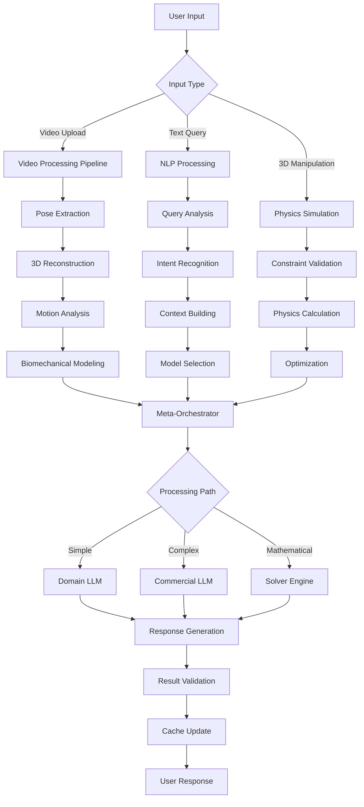

# Platform Architecture

## 🏗️ **System Overview**

Space Computer is built as a **distributed, microservices-based platform** that seamlessly integrates computer vision, AI reasoning, biomechanical simulation, and interactive 3D visualization. The architecture is designed for scalability, real-time performance, and modular expansion.

## 🔧 **Core Architecture Principles**

### **1. Microservices Design**
- Each major component operates as an independent service
- Horizontal scaling based on demand
- Service discovery and load balancing
- Fault tolerance and graceful degradation

### **2. AI-First Architecture**
- Multiple AI models working in coordination
- Intelligent routing based on query complexity
- Real-time model switching and optimization
- Context-aware processing pipeline

### **3. Real-Time Performance**
- WebGL-based 3D rendering at 60fps
- GPU-accelerated physics simulation
- WebRTC for low-latency video streaming
- Edge computing for instant responsiveness

### **4. Data-Driven Intelligence**
- Comprehensive movement pattern database
- Continuous learning from user interactions
- Knowledge distillation from expert models
- Community-driven content creation

## 🌐 **System Architecture Diagram**

```
┌─────────────────────── USER INTERFACE LAYER ───────────────────────┐
│                                                                     │
│  ┌──────────────────┐  ┌──────────────────┐  ┌─────────────────┐   │
│  │   Space Computer │  │   Mobile App     │  │  Web Dashboard  │   │
│  │   (Main 3D UI)   │  │  (Camera Input)  │  │ (Admin/Analytics)│   │
│  └──────────────────┘  └──────────────────┘  └─────────────────┘   │
│                                                                     │
└─────────────────────────────────────────────────────────────────────┘
                                    │
                                    ▼
┌─────────────────────── API GATEWAY & LOAD BALANCER ────────────────────┐
│                                                                         │
│  ┌─────────────────┐  ┌─────────────────┐  ┌────────────────────────┐ │
│  │  Authentication │  │   Rate Limiting │  │    Service Discovery   │ │
│  │   & Security    │  │   & Caching     │  │    & Load Balancing    │ │
│  └─────────────────┘  └─────────────────┘  └────────────────────────┘ │
│                                                                         │
└─────────────────────────────────────────────────────────────────────────┘
                                    │
                                    ▼
┌──────────────────── ORCHESTRATION LAYER (Brain) ─────────────────────┐
│                                                                       │
│  ┌─────────────────────────────────────────────────────────────────┐ │
│  │                META-ORCHESTRATOR                                │ │
│  │              (Intelligent Decision Engine)                      │ │
│  │                                                                 │ │
│  │  • Query Complexity Analysis    • Model Selection Logic        │ │
│  │  • Processing Path Routing      • Performance Monitoring       │ │
│  │  • Result Validation           • Cache Management             │ │
│  └─────────────────────────────────────────────────────────────────┘ │
│                                                                       │
│  ┌─────────────────┐  ┌─────────────────┐  ┌─────────────────┐     │
│  │ Query Processor │  │ GLB Interpreter │  │   RAG Engine    │     │
│  │                 │  │                 │  │                 │     │
│  │ • NLP Parsing   │  │ • 3D Model      │  │ • Knowledge     │     │
│  │ • Intent        │  │   Parameter     │  │   Retrieval     │     │
│  │   Recognition   │  │   Extraction    │  │ • Context       │     │
│  │ • Context       │  │ • Joint State   │  │   Enhancement   │     │
│  │   Building      │  │   Analysis      │  │ • Citation      │     │
│  └─────────────────┘  └─────────────────┘  └─────────────────┘     │
│                                                                       │
│  ┌─────────────────┐  ┌─────────────────┐  ┌─────────────────┐     │
│  │ Query Processor │  │ GLB Interpreter │  │   RAG Engine    │     │
│  │                 │  │                 │  │                 │     │
│  │ • NLP Parsing   │  │ • 3D Model      │  │ • Knowledge     │     │
│  │ • Intent        │  │   Parameter     │  │   Retrieval     │     │
│  │   Recognition   │  │   Extraction    │  │ • Context       │     │
│  │ • Context       │  │ • Joint State   │  │   Enhancement   │     │
│  │   Building      │  │   Analysis      │  │ • Citation      │     │
│  └─────────────────┘  └─────────────────┘  └─────────────────┘     │
│                                                                       │
└───────────────────────────────────────────────────────────────────────┘
                                    │
                                    ▼
┌──────────────────────── AI PROCESSING LAYER ────────────────────────┐
│                                                                      │
│  ┌─────────────────┐  ┌─────────────────┐  ┌─────────────────┐    │
│  │ Computer Vision │  │ Biomechanical   │  │ Natural Language│    │
│  │                 │  │   Solver        │  │      AI         │    │
│  │ • 2D Pose Est.  │  │                 │  │                 │    │
│  │ • 3D Lift       │  │ • Physics Sim.  │  │ • Commercial    │    │
│  │ • Motion Track  │  │ • Optimization  │  │   LLMs          │    │
│  │ • Scene Analysis│  │ • Biomech Math  │  │ • Domain LLMs   │    │
│  └─────────────────┘  └─────────────────┘  └─────────────────┘    │
│                                                                      │
│  ┌─────────────────┐  ┌─────────────────┐  ┌─────────────────┐    │
│  │ Elite Athlete   │  │ Video Analysis  │  │ Knowledge Graph │    │
│  │   Processing    │  │                 │  │                 │    │
│  │ • Data Loading  │  │ • Quality Check │  │ • Technique DB  │    │
│  │ • Pose Analysis │  │ • Frame Extract │  │ • Pattern Match │    │
│  │ • Comparison    │  │ • Compression   │  │ • Similarity    │    │
│  └─────────────────┘  └─────────────────┘  └─────────────────┘    │
│                                                                      │
└──────────────────────────────────────────────────────────────────────┘
                                    │
                                    ▼
┌────────────────────── DATA & STORAGE LAYER ──────────────────────────┐
│                                                                       │
│  ┌─────────────────┐  ┌─────────────────┐  ┌─────────────────┐     │
│  │ Video Storage   │  │   Pose Database │  │ Knowledge Base  │     │
│  │                 │  │                 │  │                 │     │
│  │ • Raw Videos    │  │ • 3D Poses      │  │ • Techniques    │     │
│  │ • Processed     │  │ • Annotations   │  │ • Research      │     │
│  │ • Thumbnails    │  │ • Metadata      │  │ • Best Practices│     │
│  │ • Streams       │  │ • Comparisons   │  │ • Patterns      │     │
│  └─────────────────┘  └─────────────────┘  └─────────────────┘     │
│                                                                       │
│  ┌─────────────────┐  ┌─────────────────┐  ┌─────────────────┐     │
│  │ Elite Athlete   │  │ Analytics DB    │  │  Cache Layer    │     │
│  │   Database      │  │                 │  │                 │     │
│  │ • Athlete Data  │  │ • Usage Stats   │  │ • Redis Cluster│     │
│  │ • Motion Capture│  │ • Performance   │  │ • CDN Cache     │     │
│  │ • Biomech Data  │  │ • AI Metrics    │  │ • Model Cache   │     │
│  │ • Performance   │  │ • Error Logs    │  │ • Result Cache  │     │
│  └─────────────────┘  └─────────────────┘  └─────────────────┘     │
│                                                                       │
└───────────────────────────────────────────────────────────────────────┘
                                    │
                                    ▼
┌─────────────────────── INFRASTRUCTURE LAYER ──────────────────────────┐
│                                                                        │
│  ┌─────────────────┐  ┌─────────────────┐  ┌─────────────────┐       │
│  │   Kubernetes    │  │   Monitoring    │  │   Security      │       │
│  │                 │  │                 │  │                 │       │
│  │ • Container     │  │ • Prometheus    │  │ • OAuth 2.0     │       │
│  │   Orchestration │  │ • Grafana       │  │ • Encryption    │       │
│  │ • Auto-scaling  │  │ • Alerting      │  │ • Rate Limiting │       │
│  │ • Service Mesh  │  │ • Tracing       │  │ • DDoS Protection│       │
│  └─────────────────┘  └─────────────────┘  └─────────────────┘       │
│                                                                        │
│  ┌─────────────────┐  ┌─────────────────┐  ┌─────────────────┐       │
│  │   Cloud Infra   │  │   Edge Computing│  │    GPU Cluster  │       │
│  │                 │  │                 │  │                 │       │
│  │ • AWS/GCP/Azure │  │ • CDN Endpoints │  │ • AI Inference  │       │
│  │ • Multi-Region  │  │ • Edge Compute  │  │ • Physics Sim   │       │
│  │ • Disaster      │  │ • Low Latency   │  │ • Parallel Proc │       │
│  │   Recovery      │  │ • Geo-Location  │  │ • Ray Cluster   │       │
│  └─────────────────┘  └─────────────────┘  └─────────────────┘       │
│                                                                        │
└────────────────────────────────────────────────────────────────────────┘
```

## 🚀 **Core Components Deep Dive**

### **1. Space Computer (Frontend)**

**Technology Stack:**
- **React Three Fiber**: 3D WebGL rendering
- **Remotion**: Video rendering and animation
- **Next.js**: Server-side rendering and routing
- **TypeScript**: Type-safe development
- **Tailwind CSS**: Responsive UI design

**Key Features:**
- **3D Pose Manipulation**: Real-time joint editing with physics constraints
- **AI Chat Interface**: Conversational analysis and explanations
- **Video Player**: Interactive overlay system with frame-precise control
- **Community Platform**: Sharing, discovery, and social features

**Architecture:**
```typescript
interface SpaceComputerArchitecture {
  // Core 3D Engine
  renderingEngine: {
    webgl: "React Three Fiber";
    physics: "Cannon.js + GPU.js";
    animation: "Remotion + Framer Motion";
    assets: "3D Models, Textures, Animations";
  };
  
  // User Interface
  userInterface: {
    chat: "AI Conversational Interface";
    manipulation: "3D Joint Control System";
    player: "Interactive Video Player";
    social: "Community & Sharing Platform";
  };
  
  // State Management
  stateManagement: {
    global: "Zustand Store";
    async: "React Query";
    realtime: "Socket.IO Client";
    cache: "Browser Storage + Service Worker";
  };
  
  // Communication
  communication: {
    api: "REST + GraphQL + WebSocket";
    streaming: "WebRTC for video";
    upload: "Chunked file upload";
    offline: "Progressive Web App";
  };
}
```

### **2. Backend AI Processing Pipeline**

**Technology Stack:**
- **FastAPI**: High-performance Python API
- **PyTorch**: AI model inference
- **OpenCV**: Computer vision processing
- **NumPy/SciPy**: Scientific computing
- **Ray**: Distributed processing

**Computer Vision Pipeline:**
```python
class CVPipeline:
    def __init__(self):
        self.models = {
            "pose_2d": "ultralytics/yolov8s-pose",
            "pose_3d": "walterzhu/MotionBERT-Lite", 
            "motion": "Tonic/video-swin-transformer",
            "quality": "custom quality assessment model"
        }
    
    async def process_video(self, video_path: str) -> ProcessedVideo:
        # 1. Quality assessment and preprocessing
        quality_metrics = await self.assess_video_quality(video_path)
        
        # 2. 2D pose estimation
        poses_2d = await self.extract_2d_poses(video_path)
        
        # 3. 3D pose lifting
        poses_3d = await self.lift_to_3d(poses_2d)
        
        # 4. Motion analysis
        motion_features = await self.analyze_motion(poses_3d)
        
        # 5. Scene understanding
        scene_analysis = await self.analyze_scene(video_path)
        
        return ProcessedVideo(
            poses_3d=poses_3d,
            motion_features=motion_features,
            scene_analysis=scene_analysis,
            quality_metrics=quality_metrics
        )
```

**Biomechanical Solver:**
```python
class BiomechanicalSolver:
    def __init__(self):
        self.optimization_methods = {
            "joint_stress_minimization": self._minimize_joint_stress,
            "power_output_maximization": self._maximize_power_output,
            "energy_efficiency": self._minimize_energy_expenditure,
            "injury_risk_minimization": self._minimize_injury_risk
        }
    
    async def solve_biomechanical_problem(self, 
                                        query: Dict[str, Any]) -> Solution:
        # 1. Parse query into mathematical formulation
        problem = self.formulate_optimization_problem(query)
        
        # 2. Apply physics constraints
        constraints = self.apply_biomechanical_constraints(problem)
        
        # 3. Solve using appropriate method
        solution = await self.optimize(problem, constraints)
        
        # 4. Validate solution
        validated_solution = self.validate_solution(solution)
        
        return validated_solution
```

### **3. Orchestration System**

**Meta-Orchestrator Decision Engine:**
```python
class MetaOrchestrator:
    def __init__(self):
        self.complexity_analyzer = ComplexityAnalyzer()
        self.model_selector = ModelSelector()
        self.performance_monitor = PerformanceMonitor()
    
    async def process_query(self, query: Dict[str, Any]) -> Response:
        # 1. Analyze query complexity and context
        analysis = await self.complexity_analyzer.analyze(query)
        
        # 2. Select optimal processing path
        if analysis.requires_commercial_llm:
            if analysis.complexity > 0.85:
                processor = ClaudeProcessor()
            else:
                processor = OpenAIProcessor()
        elif analysis.requires_optimization:
            processor = BiomechanicalSolver()
        else:
            processor = DomainLLMProcessor()
        
        # 3. Process with selected method
        result = await processor.process(query)
        
        # 4. Validate and enhance result
        validated_result = await self.validate_and_enhance(result)
        
        # 5. Monitor and learn
        await self.performance_monitor.record(analysis, result)
        
        return validated_result
```

**Query Processing Pipeline:**
```python
class QueryProcessor:
    async def process(self, raw_query: str, context: Dict) -> StructuredQuery:
        # 1. Natural language understanding
        intent = await self.extract_intent(raw_query)
        entities = await self.extract_entities(raw_query)
        
        # 2. Context integration
        enriched_context = await self.integrate_context(context, entities)
        
        # 3. Query structuring
        structured_query = self.structure_query(intent, entities, enriched_context)
        
        # 4. Validation and enhancement
        validated_query = await self.validate_query(structured_query)
        
        return validated_query
```

### **4. Data Layer Architecture**

**Storage Strategy:**
```yaml
Data_Architecture:
  Video_Storage:
    Raw_Videos: "AWS S3 / Google Cloud Storage"
    Processed_Videos: "CDN + Edge caching"
    Thumbnails: "Optimized WebP images"
    Streams: "HLS/DASH adaptive streaming"
  
  Pose_Database:
    Time_Series_Data: "InfluxDB for pose sequences"
    Metadata: "PostgreSQL for structured data"
    Annotations: "MongoDB for flexible schemas"
    Search_Index: "Elasticsearch for similarity search"
  
  Knowledge_Base:
    Techniques: "Graph database (Neo4j)"
    Research_Papers: "Vector database (Pinecone/Weaviate)"
    Best_Practices: "Structured documents (PostgreSQL)"
    Embeddings: "Vector storage optimized for RAG"
  
  User_Data:
    Profiles: "PostgreSQL with GDPR compliance"
    Preferences: "Redis for fast access"
    Social_Data: "Graph database for relationships"
    Analytics: "ClickHouse for time-series analytics"
  
  Cache_Strategy:
    L1_Cache: "Browser cache + Service Worker"
    L2_Cache: "Redis cluster"
    L3_Cache: "CDN edge locations"
    Model_Cache: "GPU memory + local SSD"
```

**Data Flow Optimization:**
```python
class DataFlowOptimizer:
    def __init__(self):
        self.cache_layers = [
            BrowserCache(),
            RedisCache(),
            CDNCache(),
            DatabaseCache()
        ]
    
    async def optimize_query(self, query: Dict) -> OptimizedData:
        # 1. Check cache hierarchy
        for cache in self.cache_layers:
            if result := await cache.get(query):
                return result
        
        # 2. Compute if not cached
        result = await self.compute_result(query)
        
        # 3. Cache with appropriate TTL
        await self.cache_result(query, result)
        
        return result
```

## 🔄 **Data Flow & Communication**

### **Real-Time Communication Protocol**

```typescript
interface CommunicationProtocol {
  // WebSocket for real-time updates
  realtime: {
    protocol: "Socket.IO";
    events: [
      "pose_update",
      "ai_response", 
      "user_interaction",
      "system_status"
    ];
    rooms: ["analysis_session", "community_chat", "ai_conversation"];
  };
  
  // REST API for standard operations
  rest: {
    base_url: "/api/v1";
    endpoints: {
      "/videos": "Video upload and management";
      "/analysis": "Biomechanical analysis requests";
      "/ai": "AI chat and query processing";
      "/community": "Social features and sharing";
      "/user": "User management and preferences";
    };
  };
  
  // GraphQL for flexible data fetching
  graphql: {
    endpoint: "/graphql";
    features: [
      "Nested data fetching",
      "Real-time subscriptions",
      "Optimistic updates",
      "Cache management"
    ];
  };
  
  // WebRTC for low-latency video
  webrtc: {
    use_cases: [
      "Live video streaming",
      "Real-time pose analysis",
      "Collaborative viewing",
      "Video chat with AI"
    ];
  };
}
```

### **Processing Pipeline Flow**



## 🚀 **Deployment & Scaling Strategy**

### **Kubernetes Deployment Architecture**

```yaml
 apiVersion: v1
 kind: Namespace
 metadata:
   name: space-computer

 ---
 # Core Services
 apiVersion: apps/v1
 kind: Deployment
 metadata:
   name: meta-orchestrator
   namespace: space-computer
spec:
  replicas: 3
  selector:
    matchLabels:
      app: meta-orchestrator
  template:
    metadata:
      labels:
        app: meta-orchestrator
    spec:
      containers:
               - name: orchestrator
         image: space-computer/meta-orchestrator:latest
        resources:
          requests:
            memory: "512Mi"
            cpu: "250m"
          limits:
            memory: "2Gi"
            cpu: "1000m"
        env:
        - name: OPENAI_API_KEY
          valueFrom:
            secretKeyRef:
              name: ai-secrets
              key: openai-key
        - name: ANTHROPIC_API_KEY
          valueFrom:
            secretKeyRef:
              name: ai-secrets
              key: anthropic-key

---
# AI Processing Services
apiVersion: apps/v1
kind: Deployment
 metadata:
   name: ai-processor
   namespace: space-computer
spec:
  replicas: 5
  selector:
    matchLabels:
      app: ai-processor
  template:
    metadata:
      labels:
        app: ai-processor
    spec:
      nodeSelector:
        accelerator: nvidia-gpu
      containers:
             - name: ai-processor
         image: space-computer/ai-processor:latest
        resources:
          requests:
            nvidia.com/gpu: 1
            memory: "4Gi"
            cpu: "2000m"
          limits:
            nvidia.com/gpu: 1
            memory: "8Gi"
            cpu: "4000m"

---
# Auto-scaling Configuration
apiVersion: autoscaling/v2
kind: HorizontalPodAutoscaler
 metadata:
   name: ai-processor-hpa
   namespace: space-computer
spec:
  scaleTargetRef:
    apiVersion: apps/v1
    kind: Deployment
    name: ai-processor
  minReplicas: 2
  maxReplicas: 20
  metrics:
  - type: Resource
    resource:
      name: cpu
      target:
        type: Utilization
        averageUtilization: 70
  - type: Resource
    resource:
      name: memory
      target:
        type: Utilization
        averageUtilization: 80
```

### **Monitoring & Observability**

```yaml
Monitoring_Stack:
  Metrics:
    Prometheus: "System and application metrics"
    Grafana: "Dashboards and visualization"
    AlertManager: "Intelligent alerting"
  
  Logging:
    ELK_Stack: "Centralized logging"
    Fluent_Bit: "Log collection and forwarding"
    Kibana: "Log analysis and search"
  
  Tracing:
    Jaeger: "Distributed tracing"
    OpenTelemetry: "Instrumentation"
    Service_Map: "Visual service dependencies"
  
  Performance:
    APM: "Application performance monitoring"
    RUM: "Real user monitoring"
    Synthetic: "Proactive performance testing"
  
  Business_Metrics:
    User_Analytics: "Usage patterns and behavior"
    AI_Performance: "Model accuracy and latency"
    System_Health: "Infrastructure reliability"
    Cost_Optimization: "Resource utilization tracking"
```

### **Security Architecture**

```typescript
interface SecurityFramework {
  authentication: {
    method: "OAuth 2.0 + OpenID Connect";
    providers: ["Google", "GitHub", "Apple", "Custom"];
    mfa: "TOTP + WebAuthn";
    session_management: "JWT with refresh tokens";
  };
  
  authorization: {
    model: "RBAC (Role-Based Access Control)";
    permissions: [
      "video.upload",
      "analysis.request", 
      "ai.query",
      "community.share",
      "admin.manage"
    ];
    api_scoping: "Granular endpoint permissions";
  };
  
  data_protection: {
    encryption_at_rest: "AES-256 encryption";
    encryption_in_transit: "TLS 1.3";
    key_management: "AWS KMS / Azure Key Vault";
    pii_handling: "GDPR compliant data processing";
  };
  
  api_security: {
    rate_limiting: "Token bucket algorithm";
    ddos_protection: "Cloudflare / AWS Shield";
    input_validation: "Comprehensive sanitization";
    cors_policy: "Strict origin validation";
  };
  
  privacy: {
    data_anonymization: "Automatic PII removal";
    consent_management: "Granular privacy controls";
    data_retention: "Configurable retention policies";
    right_to_deletion: "Complete data removal";
  };
}
```

## 📊 **Performance Specifications**

### **Target Performance Metrics**

```yaml
Performance_Targets:
  Response_Times:
    Video_Upload: "< 2 seconds for 100MB file"
    Pose_Extraction: "< 5 seconds for 30-second video"
    AI_Response: "< 1 second for simple queries"
    3D_Manipulation: "60fps real-time interaction"
    Search_Results: "< 500ms for technique lookup"
  
  Throughput:
    Concurrent_Users: "10,000+ simultaneous users"
    Video_Processing: "1000+ videos per hour"
    AI_Queries: "50,000+ queries per minute"
    Real_Time_Updates: "100,000+ WebSocket connections"
  
  Availability:
    Uptime: "99.9% availability SLA"
    Recovery_Time: "< 5 minutes for critical failures"
    Data_Durability: "99.999999999% (11 9's)"
    Global_Latency: "< 100ms in major regions"
  
  Scalability:
    Horizontal_Scaling: "Auto-scale to 1000+ nodes"
    Storage_Scaling: "Petabyte-scale data storage"
    Geographic_Distribution: "Multi-region deployment"
    Load_Balancing: "Intelligent traffic distribution"
```

### **Resource Optimization**

```python
class ResourceOptimizer:
    def __init__(self):
        self.gpu_scheduler = GPUScheduler()
        self.cache_optimizer = CacheOptimizer()
        self.cost_optimizer = CostOptimizer()
    
    async def optimize_workload(self, workload: Workload) -> OptimizedPlan:
        # 1. Analyze workload characteristics
        analysis = await self.analyze_workload(workload)
        
        # 2. Optimal resource allocation
        if analysis.is_gpu_intensive:
            plan = await self.gpu_scheduler.schedule(workload)
        elif analysis.is_io_intensive:
            plan = await self.io_optimizer.optimize(workload)
        else:
            plan = await self.cpu_optimizer.optimize(workload)
        
        # 3. Cost optimization
        optimized_plan = await self.cost_optimizer.optimize(plan)
        
        return optimized_plan
```

This platform architecture provides a solid foundation for building the revolutionary Space Computer system, ensuring scalability, performance, and reliability while maintaining the flexibility needed for continuous innovation and feature expansion.
